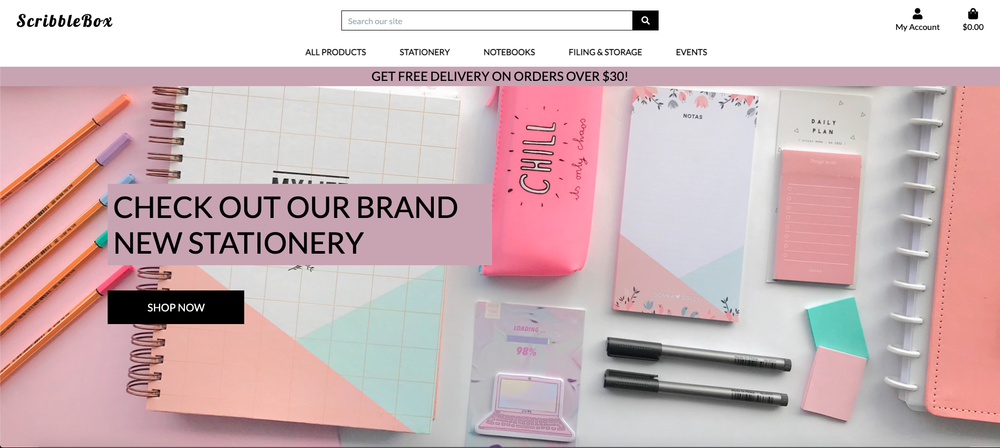
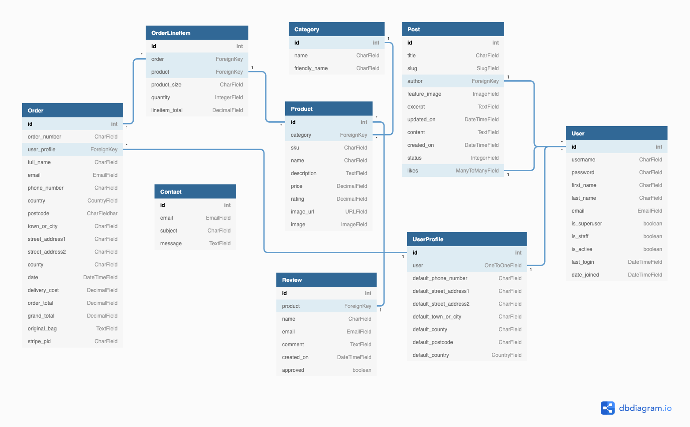
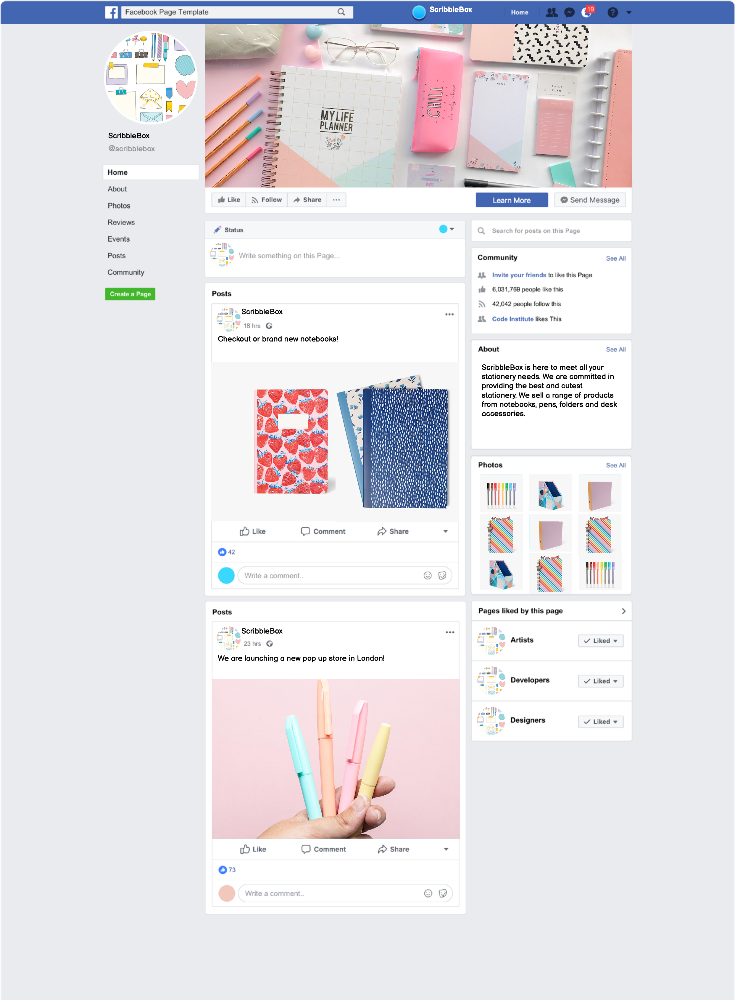

# ScribbleBox

[View published site on Heroku](https://p5-scribblebox.herokuapp.com/).

## Project Overview

ScribbleBox is an e-commerce website that aims to provide users with a variety of stationery to browse and purchase from. This site has been created as part of my Portfolio Project 5 for Code Institute.

## Table of Contents

1. [User Experience (UX)](#ux)
    * [Strategy](#strategy)
        * [Project Goals](#project-goals)
        * [User Stories](#user-stories)
    * [Scope](#scope)
    * [Design](#design)
        * [Colours](#colours)
        * [Typography](#typography)
        * [Imagery](#imagery)
    * [Skeleton](#skeleton)
        * [Wireframes](#wireframes)
        * [Database](#database)
2. [Features](#features)
    * [Current Features](#current-features)
    * [Future Features](#future-features)
3. [Web Marketing & Business](#web-marketing-business)
4. [Technologies Used](#tech-used)
5. [Testing](#testing)
    * [User Stories Testing](#user-testing)
    * [Validation Testing](#validation-testing)
    * [Known Issues and Resolutions](#issues)
6. [Deployment](#deployment)
7. [Credits](#credits)
8. [Acknowledgements](#acknowledgements)

## User Experience (UX) 

## Strategy 

### Project Goals 

The main business goal for ScribbleBox is to provide users with an e-commerce website from which the user can view variety of stationery products and have the ability to add items to their basket to be able to make a purchase. The website also aims to provide a functionality for users to be able to create their own accounts to checkout and leave reviews for different products.

The business model for this website is B2C (Business to Customer). The main target audience for this website are stationery lovers, who enjoy collecting various types of stationery to add to their collection. The business also extends to a more general audience of people, so that anyone who is looking to get new and unique stationery can do so through this website.

### User Stories 

* __Site User & Shopper Goals:__

  * As a Shopper I want to be able to view a list of products so that I can select something to purchase
  * As a Shopper I want to be able to view individual product detail so that I can identify the price, description, product rating and product image
  * As a Shopper I want to be able to easily view the total of my purchases at any time so that I can avoid spending too much
  * As a Shopper I want to be able to sort the list of available products so that I can easily identify the best rated, best priced and categorically sort the products
  * As a Shopper I want to be able to sort a specific category of product so that I can find the best priced or best rated product in a specific category or sort the products in that category by name
  * As a Shopper I want to be able to search for a product by name or description so that I can find a specific product I’d like to purchase
  * As a Shopper I want to be able to easily see what I’ve searched for and the number of results so that I can quickly decide whether the product I want is available
  * As a Shopper I want to be able to view the details in my cart so that I can confirm everything before purchase
  * As a Shopper I want to be able to add, update and delete products in my cart so that I can take control of my purchase
  * As a Shopper I want to be able to have an easy payment system and my payment details secured so that I can feel comfortable providing information
  * As a Shopper I want to be able to add reviews to product so that I can rate the product accordingly to past purchases and use
  * As a Site User I want to be able to easily register for an account so that I can have a personal account and be able to view my profile
  * As a Site User I want to be able to easily login or logout so that I can access my personal account information
  * As a Site User I want to be able to easily recover my password in case I forget it so that I can recover access to my account
  * As a Site User I want to be able to receive an email confirmation after registering so that I can verify that my account registration was successful
  * As a Site User I want to be able to have a personalised user profile so that I can view my personal order history and order confirmation, and save my payment information
  * As a Site User I want to be able to contact or leave feedback regarding any queries, concerns or products
  * As a Site User I want to be able to sign up for a regular newsletter to keep up to date with the latest offers and discounts
  * As a Site User I want to be able to keep up to date with the latest events and news regarding ScribbleBox and like/unlike posts
  * As a Site User I want to be able to locate ScribbleBox's social media accounts so I can see their following and how well they are known and reliable

* __Site Owner Goals - Admin Only:__

  * As a Site Admin I want to be ble to approve or disapprove comments/reviews so that I can filter out objectionable comments
  * As a Site Admin I want to be able to create draft posts/products so that I can finish writing the content later
  * As a Site Admin I want to be able to create, read, update and delete posts/products so that I can manage my blog content
  * As a Site Admin I want to be able to provide a simple design so that users have an incentive to return back to the website
  * As a Site Admin I want to be able to gather user email addresses so that I can mail details about new products
  * As a Site Admin I want to be able to protect the website so that only authorised users can make any changes

## Scope 

To achieve the strategy goals, I want to implement the following features:

* A navigation bar fixed at the top of the screen which will allow the user to easily navigate and find the relevant sections
* A Home page which will allow the user to easily access the Products page to start shopping
* A Products page to allow user to view different products available for purchase
* A Bag page to allow the user to view the items added to their bag and amend any quantities
* A Checkout page to allow users to complete the purchase of the selected products
* A Profile page to allow users to view and update their delivery details and view order history
* A Contact page to allow users to submit any queries to the website owner
* An Events page to allow the user to view posts and keep up to date with news and updates as well as like/unlike posts
* A Login page for existing users to access their account to allow to like and add comments
* A Signup page to allow new users to create an account
* A Search bar to allow users to enter specific keywords to be able to locate desired products
* A Footer located at the bottom of the website which allows the user to access social media links, useful links and subscribe to newsletter
* A fully responsive design that will work on different devices including desktop, tablets, and mobile devices, allowing users to access the site anytime and anywhere
* An Error 404 Page to allow users to redirect back to Home page in case of any errors
* Full CRUD functionality for Admin to allow to create, read, update and delete products and posts

## Design 

### Colours 

The website colour scheme has been kept fairly simple, navigating between black, grey and white text as well as pastel pink, white and black background colours which complement each other and create harmony and visibility of content to the user.

The colour scheme was also derived in consideration of the website theme/business of selling cute stationery products to upkeep with the asthetic together with the products sold. 

### Typography 

The fonts were obtained from [Google Fonts](https://fonts.google.com/).

For my logo text I have used Lobster.

For the main text I have selected Lato which complements the font used for my logo. 

I have avoided using overly stylised fonts, which can be difficult to read for users, therefore ensuring the website is more accessible to users with visual impairments.

In the event the font fails to load, I have used sans-serif as a back-up font.

### Imagery 

Images are obtained from the [Freepik](https://www.freepik.com/), [Unsplash](https://unsplash.com/) and [Paperchase](https://www.paperchase.com/) websites.

I have used imagery appropriate to the website’s content to provide a more visual experience to the user.

Please see further details in the __Credits__ section for the specific images used within the project.

## Skeleton 

### Wireframes 

Wireframes were created using [Balsamiq Wireframes](https://www.balsamiq.com/).

The wireframes have examples of desktop, tablet, and mobile phone displays.

* [Home](docs/images/wf-home.png)
* [Products Page](docs/images/wf-products-page.png)
* [Product Details](docs/images/wf-products-details.png)
* [Shopping Bag](docs/images/wf-shopping-bag.png)
* [Checkout Page](docs/images/wf-checkout.png)
* [Profile Page](docs/images/wf-profile.png)
* [Contact Page](docs/images/wf-contact.png)
* [Register Page](docs/images/wf-register.png)
* [Login Page](docs/images/wf-login.png)

Overall, the finished project design is similar to what I had originally intended to create as per my wireframes. However, there are some different choices I have made for the end website such as:

* I have added the Events section to the main nav bar which users can access to view the Events page to read posts created by the site user.

* There are also some minor differences with the navigation and footer arrangements.

### Database 

Two relational databases were used to create this site.

During production SQLite was used and for deployment Heroku Postgres was used.

The database diagram was created using [dbdiagram.io](https://dbdiagram.io/home)

The database contains the following models, three of which are custom models - Review, Contact and Post.

* Order
    * Contains information about the order placed by the user, has a relationship with the OrderLineItem and UserProfile models.

* OrderLineItem
    * Contains infromation about the an entry within an order, has a relationship with the Order and Product models.

* Category
    * Contains information on different product categories, feeds the category infromation to the Product mdoel.

* Product
    * Contains information about the product, obtains category information from the Category model via ForeignKey.

* UserProfile
    * Contains information about the user, has a one to one relationship with the User model.

* User
    * Contains information about the user, this is a Django built-in model.

* Review
    * Contains information about reviews submitted by the user, has a relationship with the Product model.

* Contact
    * Contains information about form submitted by a site visitor, has no external relationships with other models.

* Post
    * Contains information about posts submitted by admin, has a relationship with the User model.

## Features 

### Current Features 

For this project I opted for a website with different pages accessed by clicking the nav links, this is fully responsive and consists of a header, footer and the following main sections; Home, Bag, Checkout, Contact, Events, Products, Profiles, Sign Up, Login and 404 page.

__Navigation__:

* This feature is present on all the pages/sections and is fixed to the top.
* The header section has a fully responsive navigation bar which consists of the logo, located on the left-hand side.
* The navigation buttons allows the user to access various pages to the site and to search products via the search bar.
* On desktop version the logo can be clicked to take the user back to the home page.
* The Search bar has placeholder text to indicate to the user that they can enter text in the box provided. 
* User can also access the bag and profile links from the navigation.
* Banner to display to the user that free shipping is available over a certain threshold.

__Home__:

* This is the default page displayed when the user accesses the website.
* This page can also be viewed by clicking the ScribbleBox logo (desktop) or the home button (mobile) from the navigation.
* A background image is presented to display various stationery products and a button to allow the user to start shopping.
* Selecting the clickable text will take the user to the products page to display all products.

__Bag__:

* User can access this section by clicking the bag icon from the navigation.
* User is displayed with all the items added to the bag with the total quantity and price.
* User can amend the quantity of the item added or completely remove this.
* User is able to go back and browse more products by selecting the 'Keep Shopping' button
* Alternatively, user can commit to the bag and proceed with the purchase by selecting the 'Secure Checkout' button

__Checkout__:

* Accessed once user clicks the 'Secure Checkout' button from the bag page.
* User is prompted to enter shipping details and card details for the payment.
* If user is already logged in then the shipping details are already pre-populated if user has previously made purchases.
* The item details and total price is displayed to the user.
* User can commit to the purchase of items by selecting the 'Complete Order' button.
* User is also able to adjust the bag by selecting the 'Adjust Bag' button which will take them back to the bag page.

__Contact__:

* Accessed once the user clicks the 'Contact Us' link from the footer.
* User is displayed with a contact form to fill out with the required fields of email, subject and message.
* Form can be submitted via the 'Send' button upon which the user will receive a confirmation page to indicate message has been submitted successfully.
* If user changes their mind, by clicking the 'Cancel' button the user will be taken back to the home page without submitting the form.
* Admin receives an email notification that a customer has submitted the form.

__Events__:

* Accessed from the main navigation under Events > Posts or by clicking the 'Events' link from the footer.
* User is displayed with posts created by the admin.
* A maximum of 6 posts are displayed per page, once over the limit user can access further posts by selecting the 'Next' button.
* User can view further details by selecting the post title, this will take them to the post detail page.
* User can navigate back to the posts page by selecting the 'Back To Posts' button.

__Products__:

* User can access this via the main navigation links which is seperated by different categories, or by selecting the 'Products' link via footer to view all products.
* On the products page, user is displayed with a view of the products available including the product image, price and rating.
* User is able to sort the product view via the 'Sort by' function.
* User can view more details by clicking on the desired product.
* The product details page displays the description of the product and allows the user to add desired quantity to the bag.
* Alternatively the user can navigate back to the product page by clicking the 'Keep Shopping' button.

__Profiles__:

* Accessed from the main navigation by selecting the 'My Account' icon and then selecting 'My Profile'.
* Delivery information is presented to the user which can be updated via the 'Update Information' button.
* Order history is also displayed to the user of any previous purchases made.

__Sign Up__:

* Accessed from the navigation bar by selecting the 'My Account' button and then 'Register' from dropdown. 
* Once selected, the user is taken to the 'Sign Up' page.
* New users are prompted to enter a username, email, email again, password and password again to confirm.
* All fields are required for the user to be able to create an account, otherwise an error is displayed.
* Upon successful creation the user is sent an email with an activation link.
* Once activated the user is verified and can login to their account.
* Alert is displayed to indicate that the user has signed in.
* Existing users are provided with the sign in link to take them to the 'Login' page.

__Login__:

* Accessed from the navigation bar by selecting the 'My Account' button and then 'Login' from the dropdown. 
* Once selected, the user is taken to the 'Login' page.
* Existing users can enter their username or email and password and click the login button.
* Upon successful login, user is taken to the 'Home' page.
* Alert is displayed to indicate that the user has signed in.
* Incorrect username and password will fail to log the user into their account and a message will be displayes on the 'Login' page to indicate this.
* New users are provided with the register link to take them to the 'Sign Up' page to create an account.
* User can also select the forgot password link to re-set the password which will take them to the password reset page.

__Logout__:

* Option only available to users who are currently logged in.
* Accessed from the navigation bar by selecting the 'My Account' button and 'Logout' from the dropdown.
* Once selected, user will be taken to the 'Sign Out' page to confirm that they wish to sign out from their account.
* User can select the sign out button option which will successfully sign out the user from their account and return them to the home page.
* Alert added to indicate that the user has signed out.

__404__:

* Only accessed when user error occurs or invalid links are being accessed.
* User is presented with the error message and provided with a link to direct back to the home page.

__Footer__:

* This feature is present on all the pages/sections.
* Social media links can be accessed by the user.
* Useful Links are available to the user to access different pages of the website. 
* A newsletter subsciption is available where user can signup for promotional offers and discounts.

__Features Exclusive to Admin__:

* Only the Admin can approve and delete user comments.
* Only the Admin can create, update and delete product and event posts.

### Future Features 

Due to time constraints, I was unable to apply additional features, in the future I would like to implement the following:

* A Wishlist functionality to allow users to add products to their wishlist and to be able to revisit this and make a purchase of the products added.

## Web Marketing & Business 

As part of web marketing a Facebook page was created for ScribbleBox. Please note, I have utilised the Code Institute template to create a mock Facebook page.

The business model for ScribbleBox is B2C (Business to Customer). As the target audience are regular customers who would access the website to make a purchase, the website has been designed to allow ease of access to view and search products as well as to add items to the bag and checkout with minimal steps to ensure that the customer goes through with the purchase. There are also additional incentives added for free delivery if spending above a certain threshold to encourage the customer to purchase more items. The website also has newsletter marketing with promotional offers and discounts to entice the customer to sign up and be a returning customer. Overall, given the business model the website has been kept as simple as possible to allow ease of navigation for the customer to ensure they commit with the purchase.

## Technologies Used 

For this project the main languages used are __HTML5__, __CSS3__, __JavaScript__, __Python__, __Django__ and __Heroku Postgres__.

I have also utilised the following frameworks, libraries, and tools:

* [Bootstrap v5.1.3](https://getbootstrap.com/): 
    * Bootstrap has been used for overall responsiveness of the website and for the layout with the addition of select classes.
* [GitPod](https://www.gitpod.io/): 
    * I used GitPod as the IDE for this project and Git has been used for Version Control.
* [GitHub](https://www.github.com/): 
    * GitHub has been used to create a repository to host the project and receive updated commits from GitPod.
* [Balsamiq](https://balsamiq.com/): 
    * I used Balsamiq to create the wireframe for the website for the basic structure and layout.
* [dbdiagram](https://dbdiagram.io/home): 
    * I used dbdiagram to create the database diagram model for the website.
* [Unsplash](https://unsplash.com/): 
    * Unsplash has been used for copyright free images for this project.
* [Freepik](https://www.freepik.com/): 
    * Freepik has been used for copyright free images for this project.
* [Google Fonts](https://getbootstrap.com/): 
    * I have used Google Fonts to import fonts for styling purposes for this project.
* [Font Awesome](https://fontawesome.com/): 
    * Font Awesome was used to apply icons in the Home, Exercises and Footer sections.
* [GIMP v2.10](https://www.gimp.org/): 
    * GIMP image manipulator program was used to edit the favicon used this project.
* [Chrome Dev Tools](https://developers.google.com/web/tools/chrome-devtools): 
    * Chrome Dev Tools was used to test the site, assist with debugging issues and run reports from Lighthouse.
* [W3C Markup Validation Service](https://validator.w3.org/): 
    * The W3C Markup Validation Service was used to validate the HTML document for this project and to identify any issues with the code.
* [W3C CSS Validation Service](https://jigsaw.w3.org/css-validator/): 
    * The W3C CSS Validation Service was used to validate the CSS document for this project and to identify any issues with the code.
* [JSHint Validation Service](https://jshint.com/): 
    * The JSHint Validation Service was used to validate the JavaScript document for this project and to identify any issues with the code.
* [PEP8 Online Validation Service](http://pep8online.com/): 
    * The PEP8 Online Validation Service was used to validate the Python document for this project and to identify any issues with the code.
* [Heroku](https://www.heroku.com/): 
    * Heroku has been used to create a repository to host the project and receive updated commits from GitPod.
* [Django](https://docs.djangoproject.com/en/3.1/): 
    * Django was used as the main framework to build this project.
* [Amazon AWS](https://aws.amazon.com/): 
    * AWS was used to store all media and static files for this project.
* [Stripe](https://stripe.com/): 
    * Stripe was used for the payment system for this project.
* [Mailchimp](https://mailchimp.com/): 
    * Mailchimp was used for the newsletter and marketing for this project.
* [Python](https://www.python.org/): 
    * Various Python modules were used to build this project as detailed below and as seen in the requirements.txt file.

## Testing 

### User Stories Testing 

__Admin Only User Story Testing__

### Validation Testing 

To test the HTML code, I used the __W3C Markup Validation Service__.

To test the CSS code, I used the __W3C CSS Validation Service__.

To test the JavaScript code, I used the __JSHint Validation Service__.

To test the Python code, I used the __PEP8 Online Validation Service__.

I also used the __Chrome Dev Tools Lighthouse Report__ to test both on desktop and mobile.

This website was tested on the following browsers:

* Google Chrome
* Safari
* Mozilla Firefox

This website was also tested on the following devices:

* iPhone 11 Pro
* iPhone 12 Pro
* iPad Pro
* MacBook Air
* Android One Plus 8 Pro

### Known Issues and Resolutions 

## Deployment 

The project was developed using GitPod and was deployed via the GitHub repository to Heroku.

The following steps were followed to deploy this project:

1. From the Heroku dashboard, select 'New' in the top right-hand corner.
2. Click 'Create new app'.
3. Enter the app name and choose region as Europe. 
4. Click 'Create app'.
5. Select the 'Settings' tab, and scroll down to 'Buildpacks'. 
6. Add 'Python' and save changes.
7. Scroll down to 'Config Vars' section, and add the 'KEY' and 'VALUE' for the AWS_ACCESS_KEY_ID, AWS_SECRET_ACCESS_KEY, DATABASE_URL, EMAIL_HOST_PASS, EMAIL_HOST_USER, SECRET_KEY, STRIPE_PUBLIC_KEY, STRIPE_SECRET_KEY, STRIPE_WH_SECRET and USE_AWS to run the app.
8. At the top of the page, click on the 'Deploy' section.
9. Select Github as deployment method.
10. Select 'Connect to Github', and locate the repository name and click on 'Connect' to link my Heroku app to my Github repository code.
11. To add the Postgres Database, click on the 'Resources' tab.
12. Under Add-ons, search for 'Heroku Postgres', click on the search result for this.
13. Select the 'Hobby Dev-Free' option and click submit order form which will add this to the Add-ons section.
14. Scroll further down, select 'Enable Automatic Deploys' and then select 'Deploy Branch' to deploy project.
15. After it has successfully deployed a 'view' button appears on screen and when clicked opens the deployed application.

## Credits 

### Content

All product content was obtained from [Paperchase](https://www.paperchase.com/).

### Media

The images used for this project were obtained from the following sources:

* Favicon - from [Freepik](https://www.freepik.com/free-vector/colorful-stationery-supplies-collection_3758873.htm#page=2&query=pencil%20icon&position=11&from_view=search)
* Header Image - from [Unsplash](https://unsplash.com/photos/OIBJaiLnMsU)
* Post Image - from [Unsplash](https://unsplash.com/photos/1lbmrKTx8gQ)
* All Product Images - from [Paperchase](https://www.paperchase.com/)

### Code

* To build the contact functionality for the website, code from [twilio](https://www.twilio.com/blog/build-contact-form-python-django-twilio-sendgrid) tutorial was used to assist with this.

* [Bootstrap](https://getbootstrap.com/) to help with styling and overall responsivness of the website.

* [Code Institute's](https://learn.codeinstitute.net/) various tutorials to assist with building this project. In addition, a large part of this project code was used and inspired from the Code Institute's Boutique Ado walkthrough to be able to build a base skeleton project. Please note some of the borrowed code has been customised by me to fit this project. I have also added my own code for additional functions for the project.

## Acknowledgements 

* I would like to thank my family and friends for their support throughout this project and for assisting with the testing stage and providing valuable feedback.
* My mentor, Guido Cecilio, for being of great support and providing valuable guidance and feedback throughout this process.